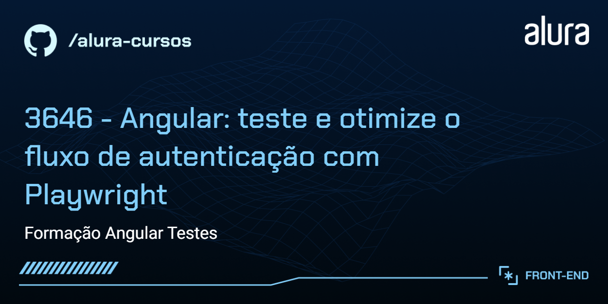

# Jornada Milhas

O Jornada Milhas é uma StartUP fictícia. Atualmente, é um site onde podemos buscar por passagens de avisão e até filtrar seus resultados por preços, conexões e companhias. Também conta com as funcionalidades de cadastro, login e edição de perfil.

## 🔨 Funcionalidades do projeto

O projeto está bastante completo e já conta alguns testes E2E (*End-to-end*) feitos em Playwright. O próximo passo é implementar testes E2E das páginas que ainda não foram testadas: as de cadastro e de edição de perfil.

Acesse o [Figma do Jornada Milhas](https://www.figma.com/file/yz38uH9MvA69Ub3FxNUbTP/Angular-Playwright-%7C-Jornada-Milhas?type=design&node-id=0-1&mode=design).

## ✔️ Técnicas e tecnologias utilizadas

- `Angular`
- `Playwright`

## 🛠️ Abrir e rodar o projeto

Para abrir e rodar o projeto, execute `npm i` para instalar as dependências e `ng serve` para iniciar o projeto.

Depois, acesse <a href="http://localhost:4200/">http://localhost:4200/</a> no seu navegador.

Você também precisa rodar o [back-end utilizado no curso](https://github.com/viniciosneves/jornada-milhas-api).
